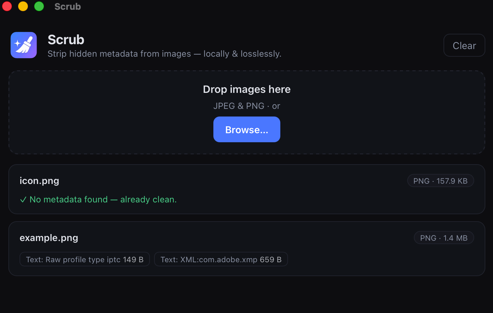

# Scrub

**Strip hidden metadata from your images — locally, and losslessly.**

Every photo your phone takes carries an invisible passenger: EXIF metadata. That
often includes the **GPS coordinates of exactly where the picture was taken**,
your device model and serial, the precise timestamp, and editing-software history.
Share the file and you share all of it.

Scrub is a tiny desktop app that drops that baggage. Drag an image in, see what's
hidden inside, and remove it with one click — without re-compressing or degrading
the picture.

> ⚠️ **Status:** v0.1, early but working. macOS-focused. JPEG and PNG today; see the roadmap below.

<!-- Add a screenshot at docs/screenshot.png and it'll render here -->
<!--  -->

## Why it's different: lossless by design

Most "strip metadata" tricks re-encode the image (e.g. redrawing it onto a canvas).
That silently **recompresses your photo and throws away quality** every time.

Scrub doesn't decode the pixels at all. It parses the file's container —
JPEG marker segments and PNG chunks — and removes **only** the metadata blocks,
copying everything else through byte-for-byte:

- ✅ Removed: EXIF (incl. GPS), XMP, IPTC, comments, PNG text chunks, timestamps
- ✅ Kept untouched: the image data and the **ICC color profile** (so colors don't shift)

The pixels you get out are bit-identical to the pixels you put in. No generational loss.

## Features

- **Drag & drop** one or many images
- **See before you strip** — a clear readout of what's embedded, including a
  📍 GPS warning with the actual coordinates
- **Lossless removal** — no re-encoding, color profile preserved
- **Safe by default** — writes a `name-clean.jpg` copy and leaves your original
  alone (optional "overwrite" toggle)
- **Reveal in Finder** when done
- **100% local** — nothing ever leaves your machine. No network, no telemetry,
  no accounts.

## Supported formats

| Format | Status |
| ------ | ------ |
| JPEG   | ✅ |
| PNG    | ✅ |
| WebP   | 🔜 planned |
| HEIC   | 🔜 planned |
| TIFF   | 🔜 planned |

## Install / run from source

Prerequisites: [Node.js](https://nodejs.org) 18+ and the
[Rust toolchain](https://www.rust-lang.org/tools/install) (Tauri's requirements
are listed [here](https://tauri.app/start/prerequisites/)).

```bash
git clone https://github.com/growthforging/scrub.git
cd scrub
npm install

# run in development
npm run tauri dev

# build a distributable .app / .dmg
npm run tauri build
```

## How to confirm it worked

After scrubbing, Scrub reports `removed N KB` and the file shows no metadata.
You can double-check with standard tools:

```bash
# should print little to nothing for the cleaned file
exiftool image-clean.jpg
mdls image-clean.jpg | grep -i gps
```

## Tech

- [Tauri v2](https://tauri.app) — tiny, fast native shell (Rust)
- [React](https://react.dev) + TypeScript + [Vite](https://vite.dev) — UI
- [`kamadak-exif`](https://crates.io/crates/kamadak-exif) — decoding EXIF for the "before" view
- Hand-written JPEG/PNG container parsing for the lossless strip (`src-tauri/src/strip.rs`),
  covered by unit tests

## License

[MIT](LICENSE)
