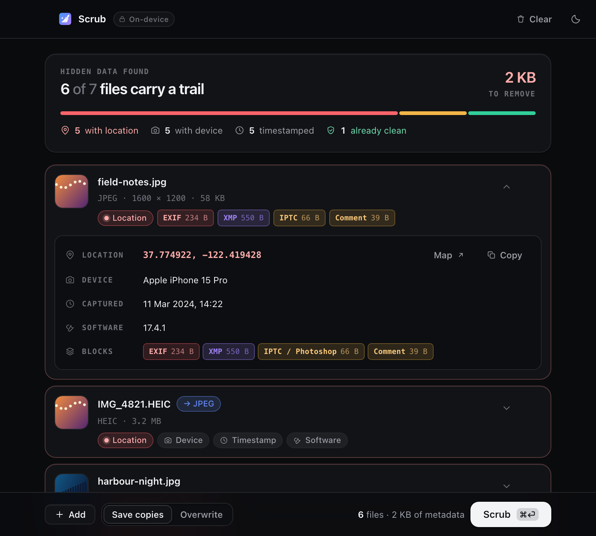
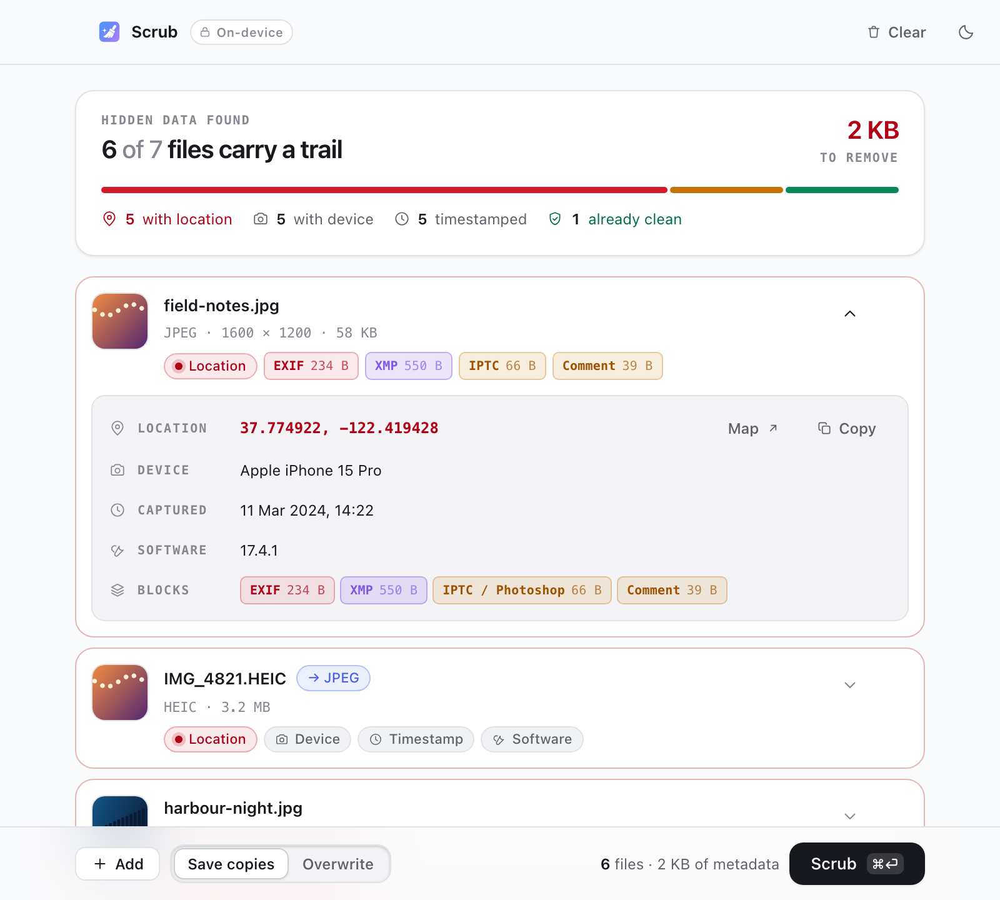
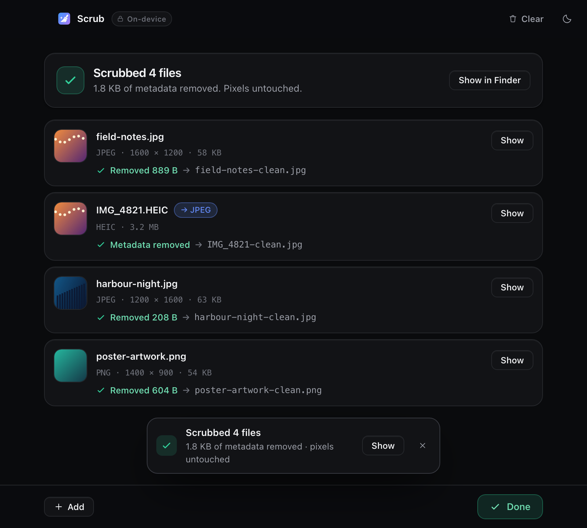

# Scrub

[](LICENSE)
[](#build-it)
[](https://github.com/growthforging/scrub/releases)

A macOS app that reads the metadata hidden inside your photos and removes it without decoding a single pixel.

Photos from a phone carry an EXIF block. Inside it sit the latitude and longitude of where you stood, the camera model, the second the shutter opened, and the software that last wrote the file. Upload the photo anywhere and the block travels with it.



Every row lists the blocks found in that file, with their sizes, before you click anything. The colour says what a block gives away.

| Colour | Blocks | What sits inside |
| ------ | ------ | ---------------- |
| Red | EXIF, Location | Latitude and longitude, camera model, capture time |
| Violet | XMP | Adobe editing history and catalogue fields |
| Amber | IPTC, comments, PNG text chunks | Author, copyright, description, source app |
| Blue | Timestamp, Device | When the file was written, and on what |

Open a row for the decoded values, a link that drops the coordinates into Maps, and a button that copies them.

## Lossless by construction

The usual way to strip metadata is to redraw the image onto a canvas and export it again. That decodes and re-encodes every pixel, so a JPEG degrades a little every time somebody does it.

Scrub works on the container format. It walks the JPEG marker segments and PNG chunks, then copies every byte that is not metadata straight through. The compressed image data reaches the output exactly as it left the input.

| Removed | Kept |
| ------- | ---- |
| EXIF (including GPS), XMP, IPTC, comments, PNG text chunks, timestamps | The compressed image data and the ICC colour profile, so colours never shift |

Strip a JPEG, a PNG or a WebP and the decoded pixels come out identical to the ones that went in. HEIC cannot be edited in place, so Scrub converts it to a clean JPEG through macOS `sips`. Video runs through `ffmpeg -map_metadata -1 -c copy`, which rewrites the container while copying the streams with no re-encode.

## What it does

- Drop in single files, a folder, or a mix of both. Folders are walked recursively.
- The panel at the top counts how many files carry something and totals the bytes about to go.
- Expanding a row reveals the coordinates, the device, the capture time, the editing software, and the raw block names with exact byte counts.
- Output lands beside the original as `name-clean.ext`. Overwriting in place is one toggle in the action bar.
- A progress bar tracks the batch, and Esc stops it part way through a large folder.
- Appearance follows the system, or you can pin it light or dark. The choice survives a relaunch.
- Scrub makes no network request at any point.

| Shortcut | Action |
| -------- | ------ |
| ⌘O | Choose files |
| Shift ⌘O | Choose a folder |
| ⌘ Return | Scrub |
| ⌘ Delete | Clear the list |
| Esc | Cancel a running batch |





## Formats

| Format | Handling |
| ------ | -------- |
| JPEG, PNG, WebP | Metadata segments dropped in place, image data untouched |
| HEIC | Converted to a clean JPEG through macOS `sips` |
| `.mov`, `.mp4`, `.m4v`, `.qt` | Remuxed by `ffmpeg`, metadata dropped, streams copied |
| TIFF, AVIF | Not supported yet |

## Build it

You need [Node.js](https://nodejs.org) 18 or newer and the [Rust toolchain](https://www.rust-lang.org/tools/install). Tauri lists its own prerequisites [here](https://tauri.app/start/prerequisites/).

```bash
git clone https://github.com/growthforging/scrub.git
cd scrub
npm install
npm run tauri dev
```

`npm run tauri build` writes a `.app` and a `.dmg` into `src-tauri/target/release/bundle`.

Video handling needs ffmpeg on the machine (`brew install ffmpeg`). Scrub checks at launch and says so on its start screen when ffmpeg is missing.


## Verify it yourself

Check that the metadata is gone:

```bash
exiftool photo-clean.jpg
mdls photo-clean.jpg | grep -i gps
ffprobe -show_format clip-clean.mov 2>&1 | grep -iE 'location|creation|make|model'
```

Then prove the image survived intact. Decoding both files to raw RGB produces the same hash, while the cleaned copy is smaller by exactly the bytes that were dropped:

```bash
magick photo.jpg RGB:- | shasum
magick photo-clean.jpg RGB:- | shasum
```

## Tech

- Tauri v2 for the shell, Rust for everything that touches a file
- React and TypeScript for the interface, bundled by Vite
- A hand written CSS token system in `src/styles`, OKLCH colour, with a light theme and a dark one. No UI framework, and no webfont fetched at runtime
- [`kamadak-exif`](https://crates.io/crates/kamadak-exif) decodes EXIF for the readout
- `src-tauri/src/strip.rs` holds the container parsers (JPEG, PNG, WebP) plus the pixel dimension readers. `cargo test` covers them
- macOS `sips` converts HEIC, [`ffmpeg`](https://ffmpeg.org) remuxes video

## License

[MIT](LICENSE)
